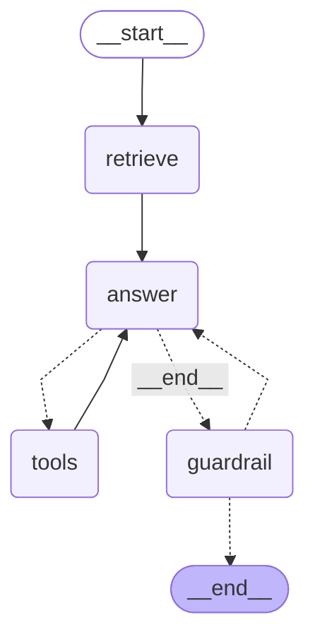

# graph-agent

A small LangGraph support agent for a fictional rental-application app ("Keystone"). Each user turn runs keyword retrieval over `docs/`, calls Claude with the retrieved context and one bound tool (`get_application_status`, an httpx call against an in-memory stub), loops through the tool if the model asks for it, and then runs a deterministic guardrail over the final answer. Conversation state is checkpointed in memory per `thread_id`. It is a stripped-down version of the agent layer I built at work; the shape is the point, not the docs.

## Graph

Output of `build_graph(model).get_graph().draw_mermaid()`:



- `retrieve` ([retrieval.py](retrieval.py)): scores the four markdown files by query-term overlap (stopwords dropped, trailing plural `s` stripped), puts the top two with any overlap in `state.context`, resets the retry counter. An off-topic query gets no docs, and the system prompt tells the model to say the docs don't cover it.
- `answer` ([graph.py](graph.py)): `ChatAnthropic.bind_tools([...]).invoke(system + history)`.
- `tools`: LangGraph's prebuilt `ToolNode`; `tools_condition` routes here when the answer contains tool calls, back to `answer` afterwards.
- `guardrail`: regex checks on the final text. On the first failure it appends a correction message and routes back to `answer`; on the second it removes the offending messages and emits a fixed fallback.

## Run

```
python3 -m venv .venv && .venv/bin/pip install -r requirements.txt
export ANTHROPIC_API_KEY=...
.venv/bin/python main.py
```

Try: `how do I reset my password`, then `what's the status of APP-1002`, then `and APP-1003?`. Stub ids are `APP-1001`, `APP-1002`, `APP-1003`; anything else returns a 404 from the stub.

## Test

```
.venv/bin/pytest
.venv/bin/ruff check .
```

Tests inject a `FakeMessagesListChatModel` subclass, so they need no API key and CI runs without secrets. They cover: retrieval ranks the right doc, the tool loop actually executes the tool, the guardrail blocks a secret-shaped string, the guardrail retries once on a fabricated application id, the fallback removes the whole failed retry (tool calls included), and messages persist across turns on one thread.

## Evals

```
.venv/bin/python -m evals.run_evals
```

[evals/cases.jsonl](evals/cases.jsonl) holds labelled cases for the two deterministic stages: retrieval (`expect` is the doc that should be in the top 2, or `null` for off-topic queries that should retrieve nothing) and the guardrail (`expect` is `block` or `pass` for a short thread). The script prints failures and per-stage pass rates and exits non-zero below `--min-pass` (default 0.8). It runs in CI after the tests. Unlike the unit tests, a failing case here is not necessarily a bug; the file is meant to grow with real queries and show whether a retrieval or regex change moves the rate.

## Design notes

**Guardrail is deterministic.** It is two regexes (secret/PII shapes, and `APP-\d+` ids not present in any user or tool message this thread). A model-graded check would cost a second call, could be wrong in the same ways the first call was, and cannot be unit-tested with fixed inputs. Regexes can, and they run in microseconds. The retry-once-then-fallback path bounds the worst case at two model calls per turn.

**Keyword retrieval, not a vector DB.** `retrieval.py` is a set-overlap scorer over four files, with a small stopword list and a naive plural strip. It is not BM25 and does not pretend to be. The point of the repo is the graph; anything with an embedding model or a vector store would add a service dependency and hide the part worth reading. Past a few hundred documents it would need replacing.

**Where the real API plugs in.** `tools.py` builds an `httpx.Client` with a `MockTransport` pointing at a dict. In production the same `get_application_status` function called a live internal endpoint; swapping the transport for a real `base_url` (and adding auth headers) is the only change. Keeping the httpx call rather than reading the dict directly means the tool-node and error paths (404 -> "not found" tool message) are exercised for real.

**Model injection.** `build_graph(model)` takes any object with `bind_tools`; `main.py` passes `ChatAnthropic`, tests pass a fake. That is the only seam.

**Checkpointing.** `MemorySaver` keeps the full message list per `thread_id`, so a follow-up like "and APP-1003?" works without re-sending history. It is process-local; a real deployment would use the SQLite or Postgres checkpointer with the same interface.
